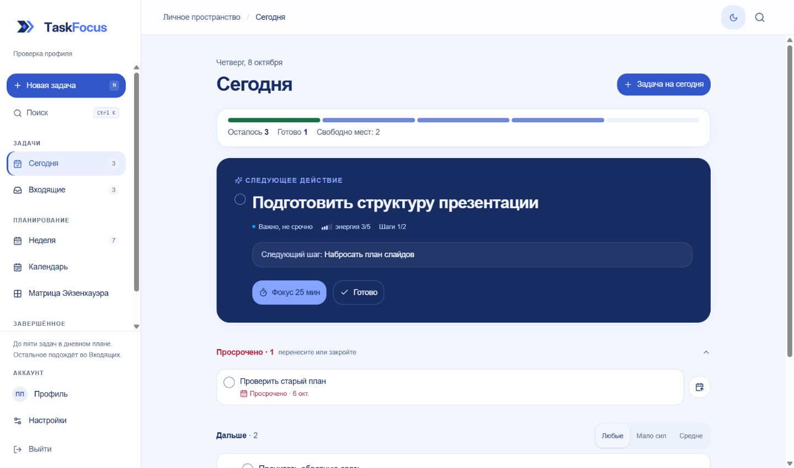
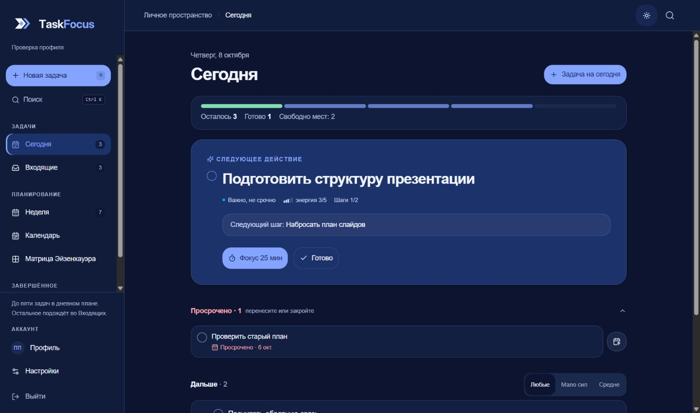
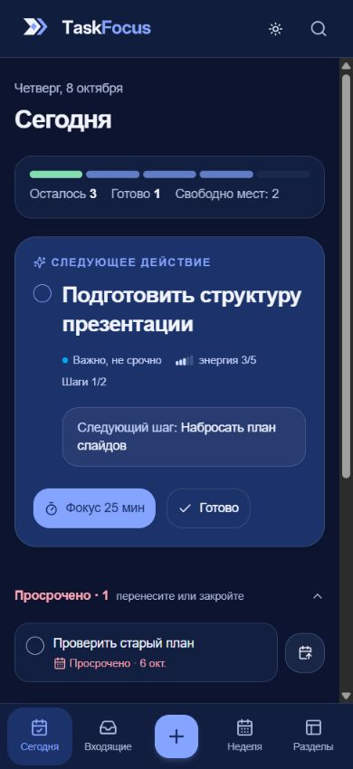
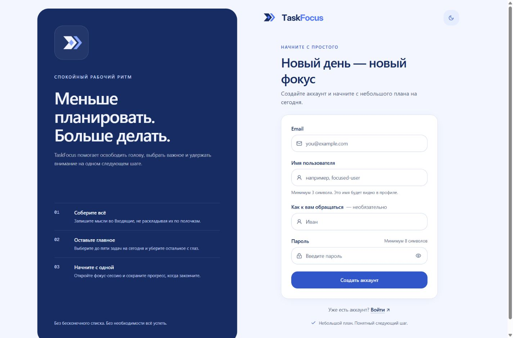
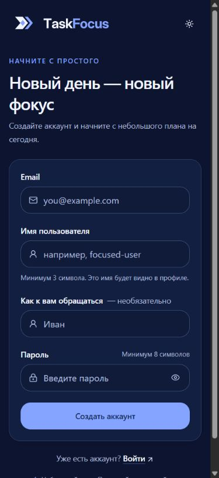

# TaskFocus — UI/UX redesign

Дата: 8 октября 2026 года. Основа: утверждённый Brand Kit v1.0, существующие
компоненты приложения и Tailwind CSS 4. Редизайн реализован в коде.

## Исследованные экраны и сценарии

Перед изменениями просмотрены все страницы `src/app`, семь представлений
dashboard, общие UI-примитивы, формы задач, состояние интерфейса и обработчики
действий. Основная проблема прежней композиции: одинаковый визуальный вес
следующего действия, вторичных параметров задачи и элементов планирования.
На телефоне плотные панели и небольшие кнопки усложняли работу.

| Экран / сценарий | Реализованные изменения |
| --- | --- |
| Сегодня | Отдельная панель прогресса, крупное следующее действие, читаемый следующий шаг, спокойный список остальных задач и просроченных дел |
| Входящие | Выделенная область быстрого ввода, просторные строки, сохранены выбор и массовые действия |
| Неделя | Карточки дней с единой иерархией даты, загрузки и задач; читаемые прошедшие дни; адаптивная сетка |
| Календарь | Компактные ячейки с индикаторами на телефоне и планшете; подробные задачи на широком экране; переход в выбранный день |
| Матрица Эйзенхауэра | Единые панели квадрантов, переносимая легенда, удобные переключатели и действия |
| День / архив | Общий масштаб заголовков и карточек, понятные пустые состояния, сохранены восстановление и удаление |
| Создание / редактирование | Скроллируемое содержимое, отдельный футер, читаемые поля и подписи, сохранены быстрый ввод, даты, шаги и автосохранение |
| Поиск | Явная кнопка закрытия на телефоне, сохранены результаты, клавиатурная навигация и открытие задачи |
| Фокус | Спокойная панель таймера, помещающиеся на 320 px кнопки; сохранены пауза, возобновление и завершение |
| Вход / регистрация | Отдельная карточка формы, крупная иерархия; брендовая вводная панель на desktop; переключение темы |
| Профиль / настройки | Общая шапка и навигация аккаунта, показатели профиля, превью тем, читаемое подтверждение удаления |
| Восстановление / ошибки / 404 | Общая оболочка служебных экранов, понятные действия; самостоятельный global-error с системной светлой/тёмной темой |

## Дизайн-система

Источник семантических токенов — `src/app/globals.css`, интеграция с Tailwind 4
через существующий `@theme inline`. Класс `.dark` и существующий ThemeProvider
управляют темой. Новых библиотек и параллельной системы стилей не добавлено.

| Роль | Light | Dark |
| --- | --- | --- |
| Фон рабочего пространства | `#F3F6FF` | `#0C1430` |
| Основной текст | `#172C62` | `#F2F5FF` |
| Карточка | `#FFFFFF` | `#121F40` |
| Приподнятая поверхность / popup | `#FFFFFF` | `#18284F` |
| Основное действие / брендовый текст | `#3156CA` | `#85A4FF` |
| Текст основного действия | `#F2F5FF` | `#172C62` |
| Спокойное выделение | `#E9EFFF` | `#1C326A` |
| Вторичный текст | `#536382` | `#ADBADA` |
| Граница | `#DAE2F2` | `#2C3D63` |
| Поле ввода | `#C7D3E9` | `#3B5078` |

Все семь исходных цветов сохранены отдельными `--tf-*` токенами. `#5278F6`
используется как яркий акцент и light focus-ring; для небольшого текста и
кнопок в светлой теме выбран более контрастный `#3156CA`. Дополнительные
оттенки нужны для слоёв интерфейса и функциональных статусов: успех, внимание,
ошибка. Статусы также обозначаются текстом, символами и состоянием контроля.

Общие правила:

- Карточки: радиус 16–20 px, диалоги 24 px, тонкая граница и умеренная тень.
- Основные заголовки: 28–36 px; подписи и вторичные сведения меньше, с явной иерархией.
- Основные кнопки и поля: 44 px. На телефоне действия строки и ручки DnD также имеют высоту 44 px.
- Переходы цвета и небольшое появление содержимого: 150–220 ms. Существующий `prefers-reduced-motion` отключает движение.
- Фокус обозначается кольцом/обводкой. Добавлена ссылка «Перейти к содержимому»; основные области доступны через `#main`.
- Меню действий задачи немодальное; стрелки и Escape обслуживает Radix, фокус возвращается на кнопку меню.

## Адаптивность

На 320/390 px используется нижняя навигация с отдельным меню остальных
разделов, безопасными отступами и крупными целями нажатия. Поля и длинные
названия переносятся; диалоги ограничены высотой viewport и прокручиваются.
Месячный календарь показывает числа и индикаторы, детали доступны через день.

С 768 px появляется компактная боковая панель; подробные карточки календаря
открываются с `lg`, чтобы планшетная сетка не становилась тесной. На 1440 px
рабочая область ограничена по ширине, а списки — дополнительно по длине строки.
Корневой `overflow-x: hidden` убран: он больше не маскирует переполнение.

SVG Brand Kit не перерисовывались. Primary/inverse переключаются существующим
BrandLogo. В шапке аккаунта на 320 px изображение имеет ширину 120 px плюс
свободное поле компонента. Production-ассеты, favicon, manifest и Metadata
сохранены из предыдущего этапа: [BRAND_INTEGRATION.md](BRAND_INTEGRATION.md).

## Сохранённые контракты

Маршруты, Prisma-схема, API, авторизация, запросы данных, Zustand-store и
доменные обработчики не переписывались. Сохранены лимит пяти активных задач
на день, диапазоны дат, фильтрация энергии, поиск по шагам, ручной порядок,
перенос задач, массовые действия, undo, автосохранение и таймер по deadline.

Изменения взаимодействия ограничены UI: закрытие поиска/мобильного меню,
клавиатурное управление выбором энергии, переключение темы и немодальное меню
задачи. Восстановление пароля по-прежнему честно сообщает о недоступности
функции; новая серверная функция восстановления не создавалась.

## Проверка

Последняя проверка после исправления меню:

- `npm run check`: ESLint и TypeScript без ошибок, **54/54 теста** прошли.
- `npm run build`: production-сборка прошла, **18/18 страниц** сгенерированы.
- Для сборки задан только процессный `DATABASE_URL` с локальным placeholder. Миграции и операции с настоящей БД не запускались.

Браузерная проверка выполнена через Codex in-app browser, Playwright locators
и CDP. `axe-core` запускался с тегами `wcag2a`, `wcag2aa`, `wcag21aa`.
Полная матрица содержит **112 состояний**: 14 экранов × 4 ширины × 2 темы.
В этих состояниях горизонтальное переполнение и нарушения указанных правил
axe не обнаружены. Это автоматизированная проверка выбранных состояний,
а не сертификат полной доступности.

| Среда | Проверенные экраны | Ширины / темы |
| --- | --- | --- |
| Настоящая Next.js production-сборка | `/login`, `/register`, `/forgot-password`, `/reset-password`, 404 | 320/390/768/1440, light + dark |
| Изолированный стенд с production-компонентами и CSS | Сегодня, Входящие, неделя, календарь, матрица, день, архив, профиль, настройки | 320/390/768/1440, light + dark |

Стенд использовал синтетические задачи и пользователя, API в памяти и
адаптеры Next navigation/Link/Image. Он не добавлен в маршруты приложения и
не отключает настоящую авторизацию. Сохранённый журнал:
[ui-redesign-verification.json](ui-redesign-verification.json).

Дополнительно проверены создание, поиск, открытие и автосохранение задачи;
пауза/возобновление фокуса; изменение имени тестового профиля; переключение
темы; восстановление, архивирование и undo; клавиатурное DnD с объявлениями;
стрелки/Home/End в выборе энергии; стрелки/Escape в меню и возврат фокуса.
Для публичных страниц проверены показ/скрытие пароля, переход между формами
и клавиатурная ссылка к содержимому. Проверены пустые списки, ошибка загрузки,
повтор запроса, skeleton, пустой поиск и подтверждение удаления без удаления.

Исправленные находки: контраст прошедших дней после группового opacity;
клавиатурное управление энергией; минимальный размер логотипа на телефоне;
`aria-hidden-focus` в модальном меню задачи; усилена обводка кнопки завершения
задачи, включая inverse-поверхность. Все 18 SVG/ICO/PNG production-ассетов
по SHA-256 совпадают с исходными файлами Brand Kit. В журнале сохранены результат
меню до исправления и повторная успешная проверка.

Границы проверки: настоящий вход, Google OAuth, серверные мутации с
PostgreSQL и сохранение DnD после чтения из БД не проверялись. Самостоятельный
global-error просмотрен в исходнике и проверен сборкой; реальное падение
корневого layout не провоцировалось. Реальные данные и `.env` не изменялись.

## Скриншоты

Dashboard использует синтетические данные; авторизация снята с production-сборки.

